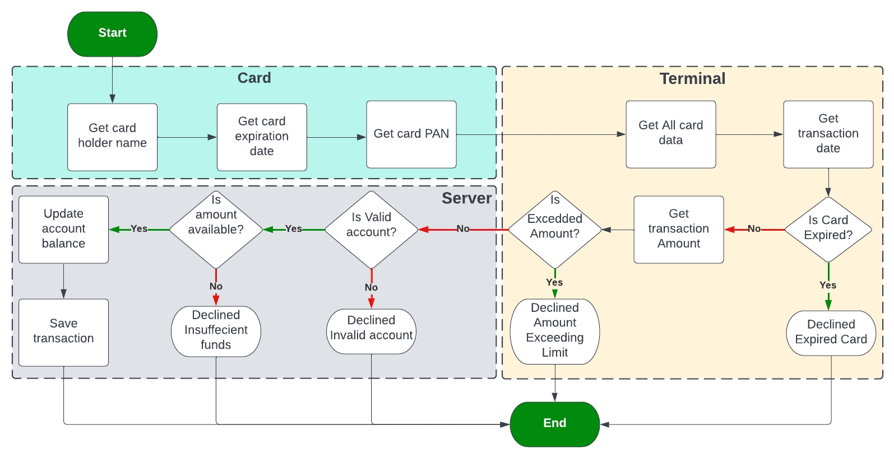

## This is c project for FWD embedded systems professional track

## The project is payment system


## Application flowchart



## Build command
``` bash
gcc main.c Card/card.c Terminal/terminal.c Application/app.c Server/server.c
```

## Run command
``` bash
./a
```